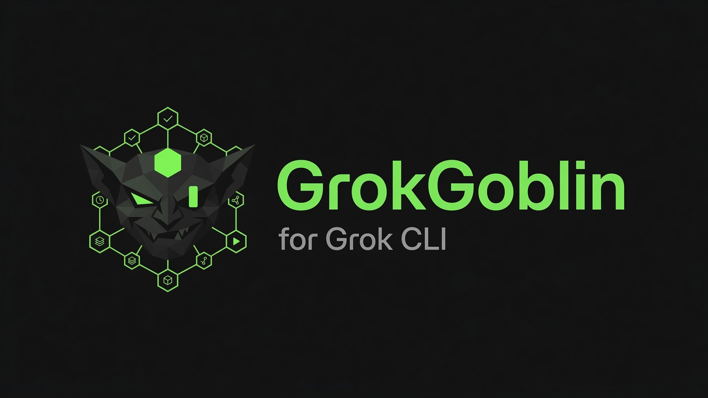

<p align="center">
  
</p>

<h1 align="center">GrokGoblin <code>(gg)</code></h1>

<p align="center">
  A multi-agent orchestration layer for the <a href="https://x.ai">xAI grok CLI</a><br>
  <em>structured workflows · native grok subagents · lifecycle hooks · durable autonomous execution · real-time web/X grounding</em>
</p>

<p align="center">
  <a href="LICENSE"></a>
  
  
  
</p>

<p align="center">
  <a href="#install">Install</a> ·
  <a href="#quickstart-your-first-5-minutes">Quickstart</a> ·
  <a href="#core-concepts">Concepts</a> ·
  <a href="#command-reference">Commands</a> ·
  <a href="#configuration">Config</a> ·
  <a href="#troubleshooting--faq">Troubleshooting</a>
</p>

---

## Table of contents

- [What is GrokGoblin?](#what-is-grokgoblin)
- [Requirements](#requirements)
- [Install](#install)
- [Quickstart: your first 5 minutes](#quickstart-your-first-5-minutes)
- [Core concepts](#core-concepts)
  - [The goblins (specialist subagents)](#the-goblins-specialist-subagents)
  - [Skills (in-session `/` commands)](#skills-in-session--commands)
  - [The orchestration brain (`AGENTS.md`)](#the-orchestration-brain-agentsmd)
  - [Memory](#memory)
  - [Worktrees](#worktrees)
  - [Hooks](#hooks)
- [Walkthroughs](#walkthroughs)
- [Command reference](#command-reference)
- [Flags reference](#flags-reference)
- [Configuration](#configuration)
- [Power features](#power-features)
- [How it integrates with grok](#how-it-integrates-with-grok)
- [Files & state layout](#files--state-layout)
- [Troubleshooting & FAQ](#troubleshooting--faq)
- [Updating & uninstalling](#updating--uninstalling)
- [License](#license)

---

## What is GrokGoblin?

GrokGoblin wraps the `grok` CLI you already use and turns it into an opinionated, repeatable engineering workflow: **clarify → plan → execute → verify**, with specialist roles, persistent loops, and an autonomous mode that keeps working until the job is actually done.

It installs natively into grok — **skills, hooks, agent roles, and `AGENTS.md`** — so everything works inside ordinary `grok` sessions, not a separate runtime. There's no extra daemon and no separate model server.

**Why use it**

- **It finishes the job.** The autonomous loops (`ralph`, `quest`, `cruise`, `goblins`) re-invoke grok across turns and only stop on a *verified* completion. The harness itself — not the model — runs your build/tests after each round (auto-detected, or `--verify "<cmd>"`); the loop can't declare done while that check is red. No runnable check? An independent QC-reviewer goblin grades the work instead. (Answer to "you're just grading vibes twice.")
- **It's token-aware.** Loops start on the fast model and only escalate to the frontier model when they stall; verification is a real command (≈0 model tokens), context stays lean per iteration, and budgets (`--max-iterations`, `--max-turns`, per-iteration timeout) stop a stuck run instead of burning tokens.
- **It thinks in specialists.** Work is delegated to themed **goblins** (analyst, planner, debugger, reviewer, …) running in parallel.
- **It uses grok's real strengths.** Live **web/X grounding**, big context (512K on `grok-build`), speed routing to the fast model, and grok's native cross-session **memory**.
- **It stays out of your way.** A small, deliberate set of `/` commands — no command sprawl.

---

## Requirements

- **[grok CLI](https://x.ai)** `0.2.x`, installed and signed in (`grok login`).
- **Node.js** `>= 20`.
- *(optional)* **tmux** — only for the visual multi-pane modes. GrokGoblin auto-detects it and falls back gracefully if it's missing.

---

## Install

**Fastest — no clone, no install (npx):**

```bash
npx grokgoblin setup    # skills, hooks, roles & AGENTS.md into ~/.grok
npx grokgoblin doctor   # verify the install (should be all green)
```

Or install once for the short `grokgoblin` (and `gg`) command:

```bash
npm install -g grokgoblin
grokgoblin setup
grokgoblin doctor
```

<details>
<summary>From source (for hacking on GrokGoblin)</summary>

```bash
git clone https://github.com/akhilkinnera01/GrokGoblin
cd GrokGoblin
npm install            # builds automatically (prepare step)
npm install -g .       # provides the `gg` and `grokgoblin` commands
gg setup
gg doctor
```

Want the very latest unreleased commit? `npx github:akhilkinnera01/GrokGoblin setup` builds and runs it straight from the repo.
</details>

> **Heads-up on the `gg` name:** if you use oh-my-zsh, `gg` is aliased to `git gui citool`. Either remove that alias, or just use the full `grokgoblin` command — they're identical. GrokGoblin's own hooks always call `grokgoblin`, so they can never be shadowed.

To verify end-to-end against grok:

```bash
gg exec --check        # grok should stream back: GrokGoblin-EXEC-OK
```

---

## Quickstart: your first 5 minutes

```bash
gg                                  # launch grok with the GrokGoblin brain loaded
gg ask "what does this regex do?"   # one-shot question, no repo needed
gg explore "how does auth work"     # read-only investigation (cannot edit files)
gg forage "best Rust web frameworks in 2026"   # read-only research + live web/X
gg ralph "make the failing tests pass"         # autonomous loop until verified done
gg goblins 3 "review this module for bugs"      # parallel specialist goblins
gg -w                               # launch in a fresh isolated git worktree
```

Inside a `grok` session you also get the GrokGoblin skills as slash commands:

```
/dig          → clarify scope before building
/goblinplan   → turn scope into an architecture + plan
/quest        → execute as checkpointed goals
/tdd          → test-driven flow
/code-review  → structured review
/cruise       → run the whole pipeline end-to-end
```

---

## Core concepts

### The goblins (specialist subagents)

GrokGoblin installs **10 specialist roles** as real grok subagents. The leader delegates independent work to them (in parallel where possible) and synthesizes the results. Read-only goblins are capability-locked so they physically cannot modify files.

| Goblin | Specialty | | Goblin | Specialty |
|---|---|---|---|---|
| **sniffer** | analyze code & requirements *(read-only)* | | **nitpick** | code review *(read-only)* |
| **schemer** | planning | | **warden** | security review *(read-only)* |
| **tinker** | architecture / design | | **forager** | research *(read-only)* |
| **basher** | implementation | | **prover** | verification / tests |
| **squasher** | debugging | | **grunt** | fast parallel worker |

Inspect them with `gg agents list`.

> **How parallelism runs:** grok's in-session subagent spawning is reliably invocable in the interactive TUI. The default **headless** `gg goblins` registers the roster (via grok's `--agents`) and spawns native subagents when the runtime allows; otherwise the leader runs the specialist passes itself, in parallel. Either way you get independent specialist passes synthesized into one result. For guaranteed multi-process parallelism, add `--tmux` (one real grok process per pane).

### Skills (in-session `/` commands)

A deliberately small set — invoke them inside a `grok` session with `/<name>`:

| Skill | Use it to… |
|---|---|
| `/dig` | clarify scope, requirements and explicit non-goals |
| `/goblinplan` | turn clarified scope into an architecture + step plan (with real-time grounding) |
| `/quest` | execute a large task as discrete, checkpointed goals |
| `/ralph` | persistently complete a single task with reflection |
| `/cruise` | run the full pipeline: **dig → goblinplan → quest → tdd → code-review** |
| `/tdd` | test-driven development flow |
| `/code-review` | comprehensive code / PR review |
| `/goblins` | coordinate parallel specialist goblins |

### The orchestration brain (`AGENTS.md`)

On `gg setup`, GrokGoblin writes an **orchestration brain** into `~/.grok/AGENTS.md` (appended to grok's system prompt). It tells grok how to use the goblins, when to recall memory, to ground in real-time web/X, and — crucially — that **verification is not optional**.

Each time you launch with `gg`, a per-session **runtime overlay** (codebase map, active workflow modes, project-memory digest, notepad) is injected directly into `AGENTS.md` and stripped on exit — so grok always has fresh context, reliably, without depending on hooks.

### Memory

GrokGoblin turns on grok's **native cross-session memory** — persistent, queryable project memory (Markdown under `~/.grok/memory/`, indexed in SQLite with hybrid FTS5 keyword + vector search), keyed per project by git remote so clones and worktrees share it. It's auto-injected on the first turn and after compaction, and grok can recall it mid-session via `memory_search`.

On top of that, every autonomous run writes a concise **digest** (goal, status, outcome) to `.grokgoblin/memory/project.md`, which the launch overlay injects next session — so GrokGoblin remembers what your last run accomplished.

```bash
gg memory                 # status + per-project stores
gg memory search "<q>"    # query cross-session memory
gg memory on | off        # toggle persistence
gg memory path            # where memory is stored
gg memory edit            # edit the global memory file
gg memory clear           # clear this workspace's memory
```

### Worktrees

Worktrees let grok work on a task on its own branch without touching your main checkout. GrokGoblin makes them first-class — smart auto-naming, one-command cleanup, and clear isolation messaging.

```bash
gg -w                        # launch in a fresh isolated worktree (auto goblin name, e.g. gg/scrappy-6791)
gg -w feature-x              # launch in a named worktree (gg/feature-x)
gg worktree                  # list worktrees (status, age, branch, path)
gg worktree new [name]       # create one (smart name if omitted)
gg worktree rm <name>        # remove (--force if dirty, --branch to also delete the branch)
gg worktree clean            # prune merged, clean worktrees (--all, --force)
gg worktree path <name>      # print path → cd "$(gg worktree path <name>)"
```

Worktrees live in a sibling `…/<repo>.gg-worktrees/<name>` directory (your main checkout stays clean), all branches use the `gg/` prefix, and because grok's memory is keyed by git remote, they **share project memory** with the main checkout.

### Hooks

`gg setup` installs lifecycle hooks into `~/.grok/hooks/hooks.json` (Claude-Code schema). They fire on grok's tool/session lifecycle in interactive sessions and log to `.grokgoblin/logs/`. Hooks are an enhancement — GrokGoblin's headless flows don't depend on them, and the runtime overlay is delivered via `AGENTS.md` at launch regardless.

---

## Walkthroughs

**Ask a quick question (no repo needed)**
```bash
gg ask "difference between rebase and merge?"
```

**Investigate a codebase without risk (read-only)**
```bash
gg explore "where is rate limiting implemented?"
```
`explore` is restricted to read/search tools — grok literally has no write tool, so it cannot modify anything.

**Research with live web + X grounding**
```bash
gg forage "current best practices for JWT rotation" --facets 3
```
Fans out parallel `forager` goblins, grounds in **today's** web/X sources with citations, and saves a report to `.grokgoblin/forage/`.

**Plan, then build**
```bash
gg                       # then inside grok:
/dig         "add OAuth login"      # clarify
/goblinplan                          # architecture + plan
/quest                               # execute as checkpoints
```

**Hands-off autonomous completion**
```bash
gg ralph  "fix the flaky test in auth.test.ts"          # one task, to completion
gg quest  "migrate the API from v1 to v2"               # multi-goal, checkpointed
gg cruise "add a /health endpoint with tests"           # full pipeline
```
All of these loop until completion is **verified** — the harness runs your build/tests itself after each round and won't let the loop stop while the check is red — or until they hit the iteration cap. Durable state lands under `.grokgoblin/<kind>/`.

Loop flags: `--verify "<cmd>"` (set the check explicitly; otherwise it's auto-detected), `--no-verify` (disable), `--max-turns N` (bound each iteration), `--max-iterations N` (bound the run), `--best-of 3` (higher quality), `--fast` / `--model <id>` (pin a model; otherwise the loop tiers fast → frontier on stall).

**Verified multi-goblin work**
```bash
gg goblins 3 "audit this service and fix the security findings"   # fan out + gate until correct
gg goblins --parallel 4 "add a unit-test file for each module"    # true OS-parallel, worktree-isolated
gg goblins 2:warden "threat-model the payment flow"               # bias toward a role
gg goblins --once 3 "summarize these docs"                        # legacy single-shot (no loop)
gg goblins --tmux 4 "refactor across these modules"               # legacy visual multi-pane
```
By default `gg goblins` fans the work out to specialist goblins and then runs the **same verification gate** as the loops above, repeating until the work is correct.

With `--parallel`, the task is split into independent units (disjoint file scopes) that each run as their **own grok process in their own git worktree** — real parallelism, no cross-contamination. Completed branches merge back; a merge conflict is deferred to the verified loop rather than auto-resolved, and the run still only finishes once the verification gate passes. If the goal can't be split cleanly, it falls back to the sequential verified loop automatically.

> **When `--parallel` actually helps:** only when the units are genuinely large or numerous — work a single agent *can't* batch into one pass (e.g. "process these 100 documents"). For ordinary tasks the sequential verified loop is **faster and cheaper**: one agent batches the work in a single call, while parallel pays a planner call + N rate-limited workers. xAI throttles concurrent requests, so parallelism scales sub-linearly. Reach for it deliberately, not by default.

---

## Command reference

### Execution
| Command | Description |
|---|---|
| `gg` | Launch grok interactively with the GrokGoblin orchestration layer. |
| `gg ask <question>` | Quick one-shot question — headless, plain output, no git repo required. |
| `gg explore <topic>` | Read-only investigation (read/search tools only — cannot modify files). |
| `gg forage <topic>` | Multi-facet **read-only** research with live web/X grounding; cited report saved to `.grokgoblin/forage/`. |
| `gg exec <prompt>` | Run a headless grok task (streaming JSON by default). |
| `gg exec --check` | Verify grok auth end-to-end. |

### Workflows (autonomous loops, verification-gated)
| Command | Description |
|---|---|
| `gg cruise <goal>` | Full pipeline loop: **dig → goblinplan → quest → tdd → code-review**. |
| `gg quest <goal>` | Durable multi-goal loop — decomposes into checkpointed sub-goals. |
| `gg ralph <task>` | Persistent single-task completion loop. |
| `gg goblins [N[:role]] <task>` | Verified loop: fan out to up to N specialist goblins, gate until correct (`--once` single-shot, `--tmux` panes). |

### Memory
| Command | Description |
|---|---|
| `gg memory [status]` | Show memory status and per-project stores. |
| `gg memory search "<q>"` | Query cross-session memory. |
| `gg memory on` / `off` | Toggle persistence. |
| `gg memory path` / `edit` / `clear` | Locate / edit global / clear workspace memory. |

### Worktrees
| Command | Description |
|---|---|
| `gg worktree` | List worktrees (status, age, branch, path). |
| `gg worktree new [name]` | Create one (smart name if omitted). |
| `gg worktree rm <name>` | Remove (`--force`, `--branch`). |
| `gg worktree clean` | Prune merged, clean worktrees (`--all`, `--force`). |
| `gg worktree path <name>` | Print a worktree's path. |

### Config & discovery
| Command | Description |
|---|---|
| `gg config` | Show GrokGoblin-managed grok settings. |
| `gg config get/set <key> [val]` | Read/write `config.toml` values (e.g. `models.default`). |
| `gg config model <frontier\|fast>` | Switch the default model. |
| `gg list [skills\|agents\|cruise\|sessions\|all]` | List installed/tracked items. |
| `gg skills [list\|info <name>\|refresh]` | Inspect installed skills. |
| `gg agents list` | List the goblin roster. |
| `gg session` · `gg state list` | Inspect session / workflow state. |

### Management
| Command | Description |
|---|---|
| `gg setup` | Install skills, hooks, roles & `AGENTS.md` into `~/.grok` (`--force` to overwrite, `--scope project`). |
| `gg doctor` | Diagnose the install and grok integration (`--verbose`, `--goblins`). |
| `gg hooks list` | List registered hooks. |
| `gg update` · `gg uninstall` · `gg version` | Lifecycle. |

---

## Flags reference

**Launch (`gg …`)**

| Flag | Effect |
|---|---|
| `-w [name]` | Launch in an isolated git worktree (auto-named if no name). |
| `--fast` | Use `grok-composer-2.5-fast`. |
| `--berserk` | Always-approve mode — no permission prompts (alias: `--yolo`). |
| `--plan` | Plan mode (headless). |
| `--direct` / `--tmux` | Force direct launch / detached tmux session. |
| `-m, --model <id>` | Use a specific model id. |

**Workflow loops (`cruise` / `quest` / `ralph`)**

| Flag | Effect |
|---|---|
| `--max-iterations <n>` | Iteration cap (default 8). |
| `--best-of <n>` | Run each iteration N ways in parallel, keep the best. |
| `--fast` / `--model <id>` | Model selection. |
| `--skip-git-repo-check` | Run outside a git repo. |
| `--no-digest` | Don't write the end-of-run memory digest. |

---

## Configuration

GrokGoblin manages real `config.toml` keys in `~/.grok` — it never invents settings.

```bash
gg config                              # show managed settings
gg config get models.default          # read a value
gg config set models.default grok-build
gg config model fast                  # convenience: switch to grok-composer-2.5-fast
```

**Models**

| Model | Role | Context window |
|---|---|---|
| `grok-build` | frontier / leader (default) | **512K tokens** |
| `grok-composer-2.5-fast` | fast worker | **200K tokens** |

A new grok model id passes straight through — there's no hard-coded allowlist gating execution, so the wrapper keeps working the day xAI ships a new model.

**Environment variables**

| Var | Purpose |
|---|---|
| `XAI_API_KEY` | xAI API key (optional — `grok login` session auth also works). |
| `GROK_HOME` | Override `~/.grok`. |
| `GG_ROOT` | Override the `.grokgoblin/` state dir. |
| `GROK_BIN` | Override the `grok` binary path. |
| `GG_LAUNCH_POLICY` | `direct` \| `tmux` \| `detached-tmux` \| `auto`. |

---

## Power features

GrokGoblin quietly wires up some of grok's most useful but lesser-known capabilities:

- **Big context, used well.** `grok-build` gives a **512K** window. The model window is the ceiling — but the autonomous loops run with **`--compaction-mode segments`**, which persists compacted history as grep-able markdown so a long run can recover earlier detail instead of losing it. Combined with native memory, effective recall stretches well past any single window.
- **Best-of-N quality.** `--best-of <n>` runs the work **N ways in parallel and keeps the best** (`grok --best-of-n`, headless only). Spend more compute when correctness matters.
- **Real-time grounding.** GrokGoblin never restricts grok's web tools on its main flows, and the brain + skills tell grok to proactively `web_search` / X-search for current versions, APIs and best practices — with citations.
- **Future-model safe.** No model allowlist gates execution, and `--effort` is only sent to models known to support it, so it can never `400` your session.
- **MCP that actually reloads.** grok runs a persistent *leader* daemon (`~/.grok/leader.sock`) that caches MCP servers across sessions — so editing your `[mcp_servers.*]` config is silently ignored until that leader dies (there's no `--mcp-config` reload flag). GrokGoblin fingerprints your effective MCP config and pins each run to a per-config leader socket (`--leader-socket`): change your MCP servers and the very next run picks them up; leave them unchanged and the warm leader is reused. No HOME-forking, and your auth/memory/skills stay shared. Opt out with `GG_NO_LEADER_ISOLATION=1`.

> ⚠️ **Reasoning effort:** the current grok models don't support a reasoning-effort parameter, so `--high` / `--effort` are accepted but no-op until grok ships an effort-capable model.

---

## How it integrates with grok

GrokGoblin uses grok's own extension points — there's no separate agent runtime:

- **Goblin subagents** → installed as real grok subagents (`config.toml [subagents.roles.*]` + per-role prompt files), and `gg goblins` also passes the roster inline via `--agents` so the `spawn_subagent` tool is registered. Read-only goblins are capability-locked.
- **Skills** → the `/` commands above, installed to `~/.grok/skills/`.
- **Hooks** → `~/.grok/hooks/hooks.json` (Claude-Code schema), firing on grok's tool/session lifecycle.
- **`AGENTS.md`** → the orchestration brain + per-session runtime overlay, appended to grok's system prompt.
- **Config & memory** → real `config.toml` keys and grok's native cross-session memory.

---

## Files & state layout

**In your project (`.grokgoblin/`)** — safe to delete; gitignore it:

```
.grokgoblin/
├── state/            active workflow mode state
├── logs/             hook & session logs
├── plans/            planning artifacts
├── memory/project.md cross-session digest (injected into AGENTS.md)
├── forage/           saved research reports
├── cruise/  quest/  ralph/   per-run state (goal.md, progress.md, log.jsonl)
└── quest/<id>/ledger.jsonl   quest checkpoint ledger
```

**Globally (`~/.grok/`)** — managed by `gg setup`:

```
~/.grok/
├── AGENTS.md         orchestration brain
├── skills/           GrokGoblin skills
├── prompts/gg-*.md   goblin role prompts
├── hooks/hooks.json  lifecycle hooks
├── config.toml       models, memory, permissions
├── leaders/          per-MCP-config leader sockets (gg-<hash>.sock)
└── memory/           grok native cross-session memory
```

Add this to your project's `.gitignore`:

```gitignore
.grokgoblin/
```

---

## Troubleshooting & FAQ

**`gg` runs `git gui citool` instead of GrokGoblin.**
oh-my-zsh aliases `gg`. Use `grokgoblin` instead, or `unalias gg`.

**`gg doctor` shows failures.**
Run `gg doctor --verbose` for fix commands. Most issues are resolved by `gg setup --force`. Make sure `grok` is on your PATH and you've run `grok login`.

**Does it need a paid grok tier?**
No. Everything (subagents, memory, hooks) works on the standard grok CLI.

**`--high` / `--effort` seem to do nothing.**
Correct — current grok models don't support reasoning effort. The flags are accepted but skipped so they can never break a session.

**Will it break when xAI releases a new model?**
No. Point at it with `gg config set models.default <new-id>` (or `gg --model <new-id>`) — there's no allowlist blocking unknown models.

**The autonomous loop stopped before finishing.**
It hit the iteration cap without a verified completion. Re-run with a higher `--max-iterations`, or review `.grokgoblin/<kind>/<id>/progress.md` to see where it got stuck.

---

## Updating & uninstalling

```bash
gg update       # pull latest + re-run setup
gg uninstall    # remove GrokGoblin hooks, roles & config keys (skills/AGENTS.md kept)
```

---

## Credits

Inspired by the `oh-my-*` developer-tooling ecosystem, including [oh-my-codex](https://github.com/Yeachan-Heo/oh-my-codex) by Yeachan Heo.

## License

MIT © akhilkinnera01
